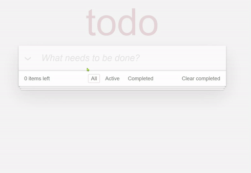
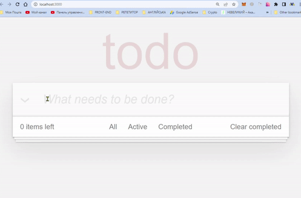

# ToDo App

[Demo](https://vlasiuk-anatolii.github.io/todo/)

## Description

## Tasks
1. Was implemented `TodoApp` component with an input field to create new todo on submit (Enter).
1. The app shows the number of not completed todos in `TodoApp`.
1. Was implemented `TodoList` component with `<ul>` element to display a list of todos.
1. Was implemented `TodoItem` component with ability to toggle the `completed` status using a checkbox.
1. Was added ability to toggle the completed status of all the todos.
1. Was created `TodosFilter` component to switch between `All`/`Active`/`Completed` todos.
1. Was added ability to remove an item.
1. Was added ability to clear completed todos - remove all completed items from the list. The button has text `Clear completed` in it.
1. Was made inline editing for the TODO item
    - double click on the TODO title makes it editable.
    - `Enter` saves changes
1. Was implemented saving state of the APP to the `localStorage`.

### Development environment
* VS Code

### devDependencies
- React
- JS
- HTML
- Node v14.18.2 and higher
- NPM v6.14.12 and higher

### Installing
* Fork and clone this repository
* Run `npm install` in your terminal
* Run `npm start`
